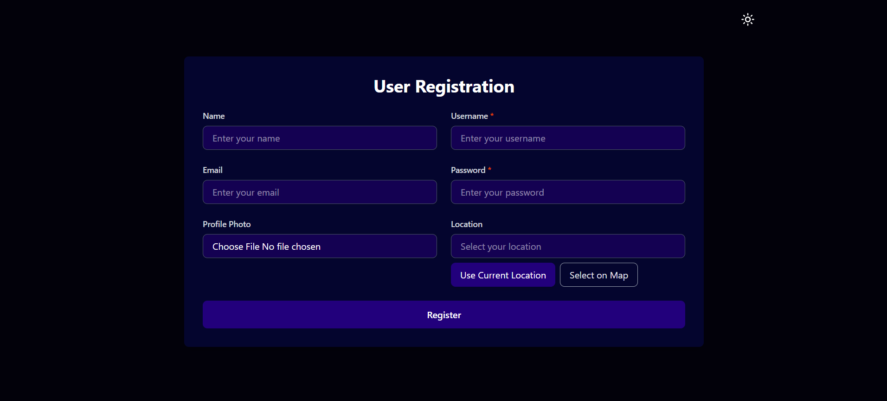
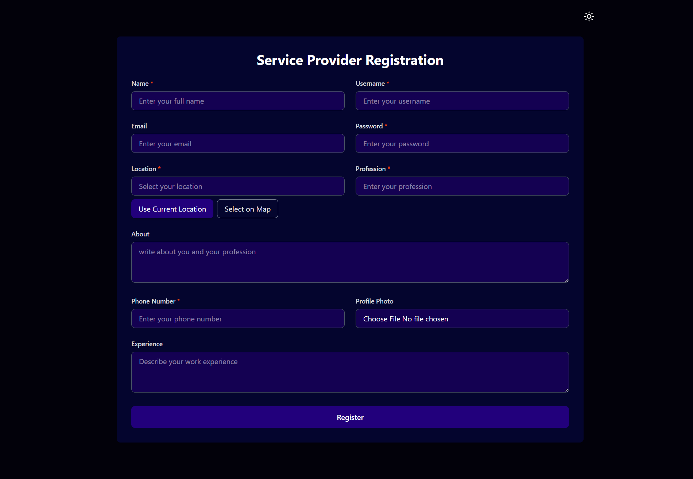
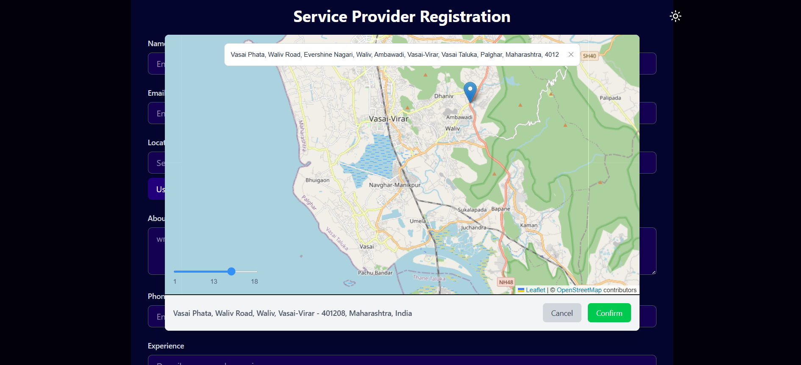
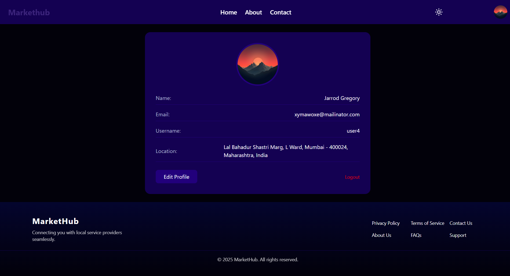
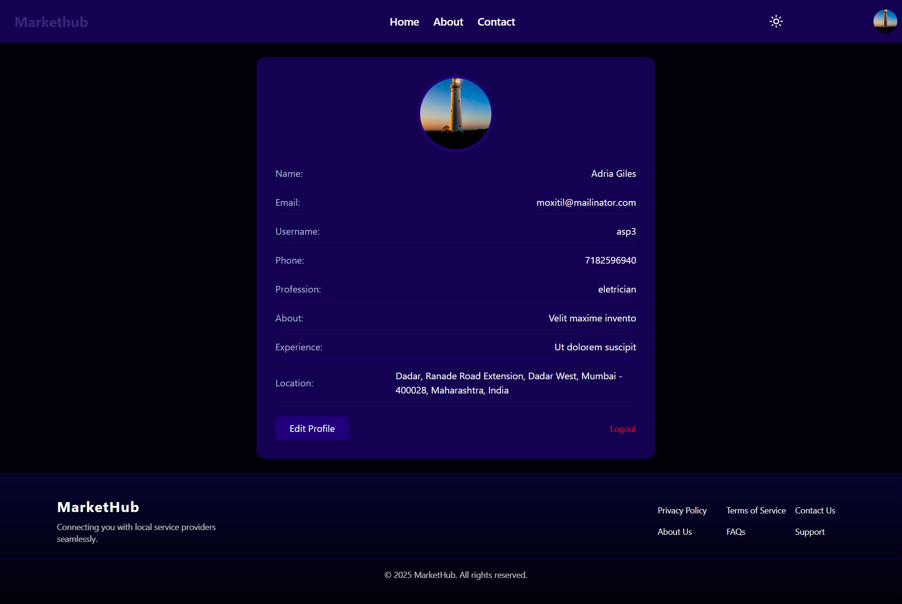
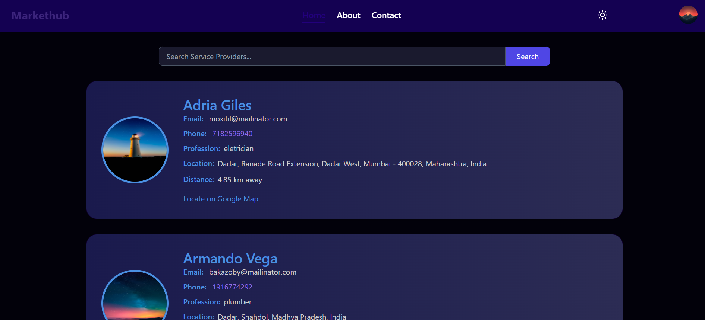
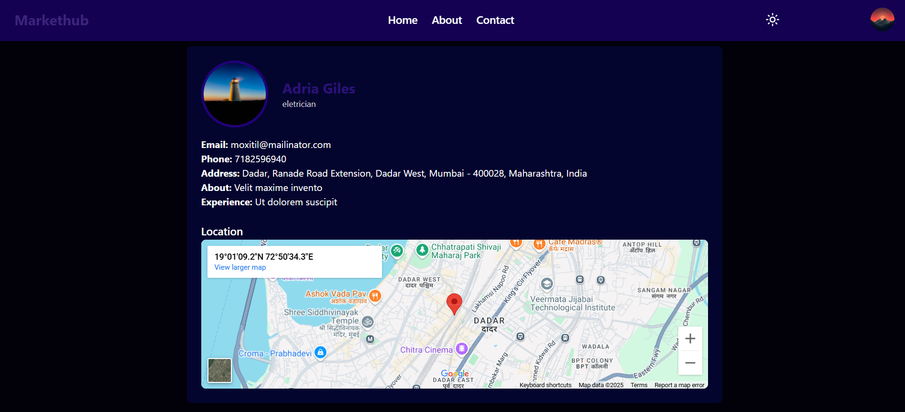

## 🌐 Live Demo

[👉 Click here to visit the live app](https://markethub-frontend-t145.onrender.com)

# 🛠️ MarketHub

## 📌 About

**MarketHub** is a platform that connects individuals with local service providers like plumbers, electricians, carpenters, and cleaners. Users can search for professionals by their service type and view key details such as contact information, location, and approximate distance.

The platform supports two types of users:

- **Users** looking for services
- **Service Providers** offering their services

---

## ✨ Features

### 👤 Authentication

- Secure registration and login for both users and service providers
- Passwords securely hashed using **bcrypt**
- **JWT-based** authentication for protecting private routes

### 🔍 Search Functionality

- Users can search for professionals by specific service types  
  _e.g., "I need a painter" or "electrician near me"_

### 🗺️ Map Integration

- Interactive map powered by **Leaflet.js** and **OpenStreetMap**

### 🧑‍🔧 Service Provider Profiles

- Each service provider has a public profile with:
  - Name, profession, and contact details
  - Profile photo and location info

### 📤 Media Uploads

- Profile images are uploaded via **Cloudinary**

### 👥 Profile Management

- Both users and service providers can update their personal information and profile images

---

## 🖼️ Screenshots

## Login

## User Registration

## Service Provider Registration

### Map

## User Profile

## Service Provider Profile

### Home Page

### Service Provider Public Profile

## 

Built with ❤️ by **Anwar Khan**
